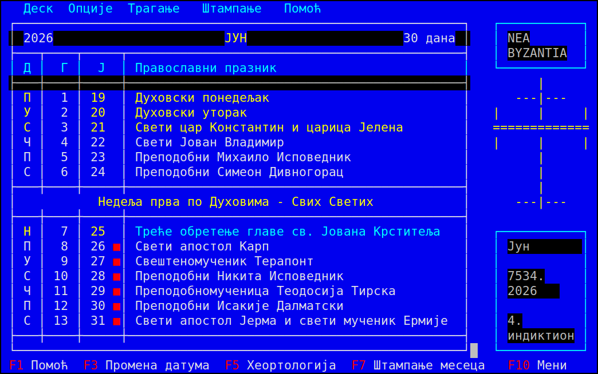
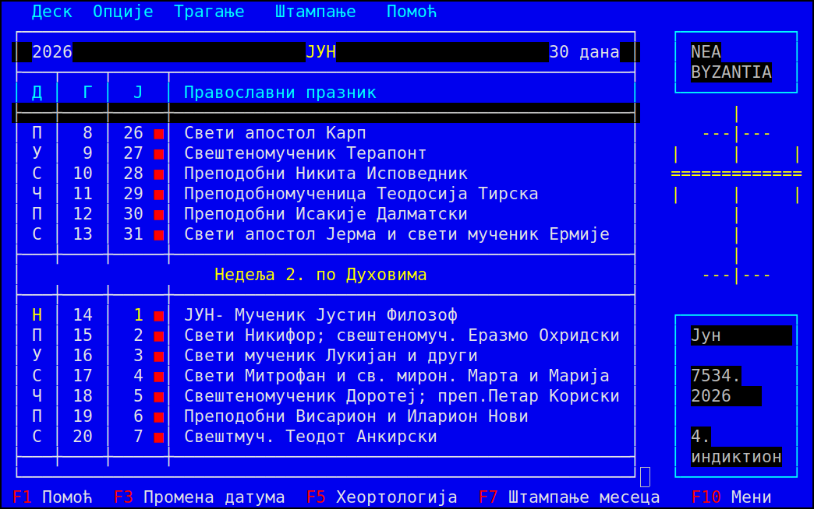
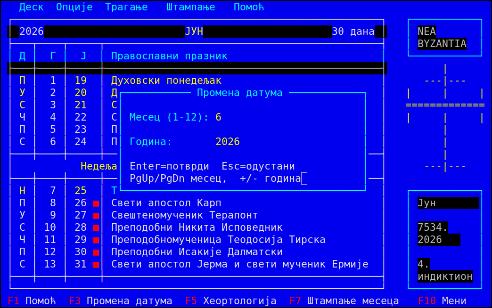
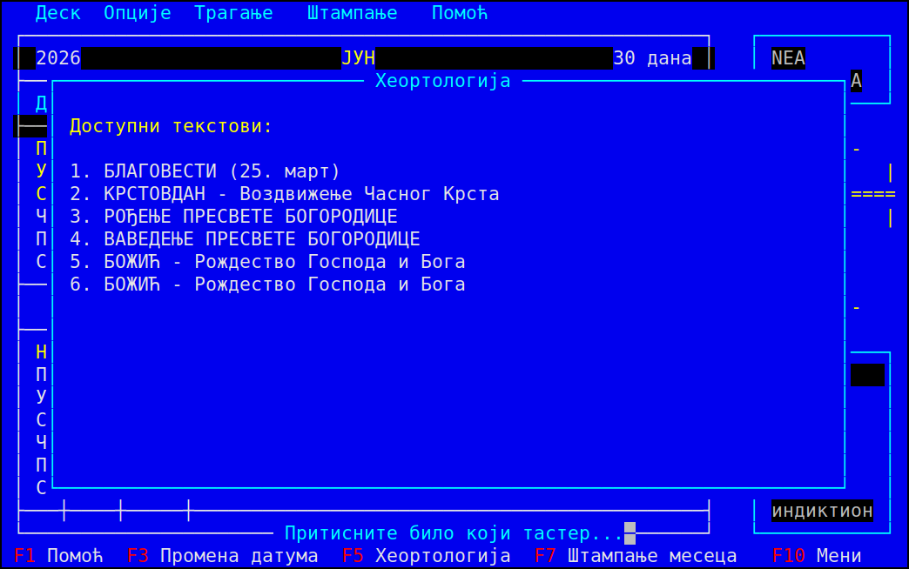
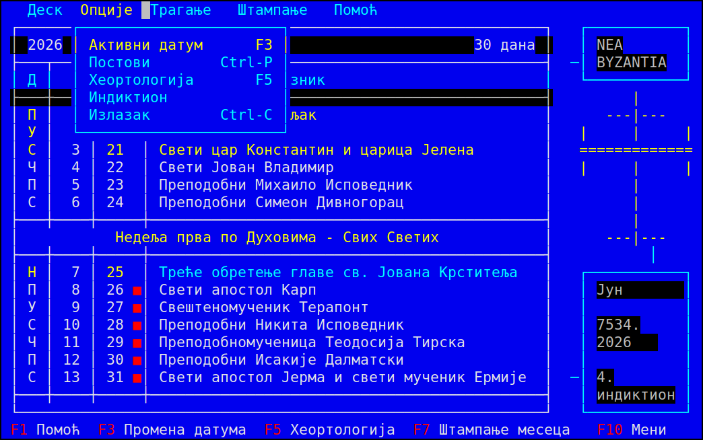
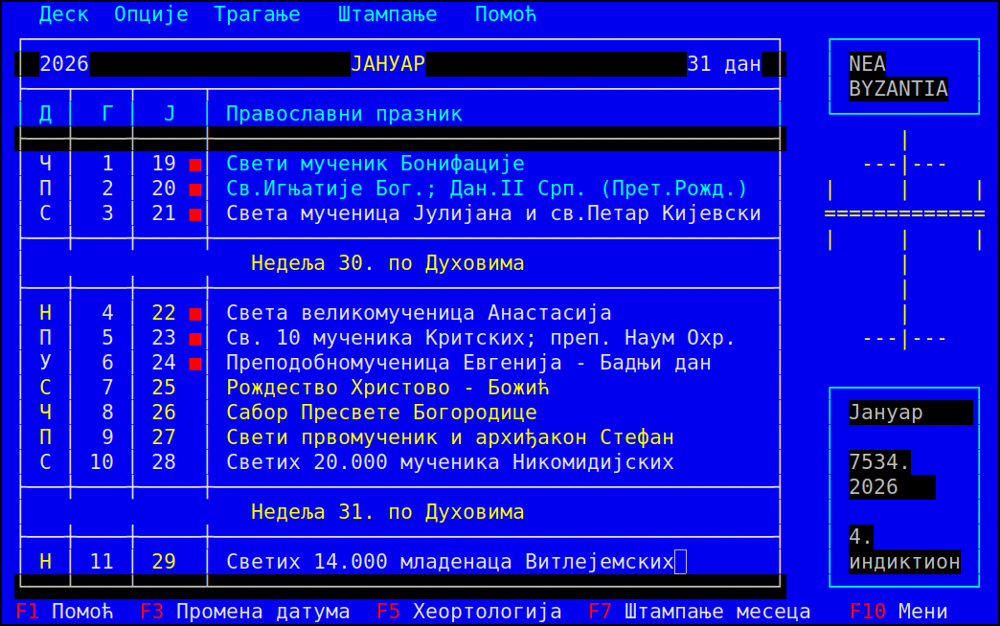

# Pravoslavni Kalendar — FPC Port

TUI calendar for the Serbian Orthodox Church, ported from the original DOS
Turbo Pascal 6/7 program to Free Pascal (FPC) for Linux, Windows, and macOS.

**Original authors:** Ivona Maric, Nikola Lecic, Nikola Reljin  
**Original release:** 1993  
**Original source:** Turbo Pascal 6/7, DOS, ~1260 lines  
**This port:** Free Pascal 3.x, cross-platform TUI (`crt` unit)

---

## О програму / About

**PravKal** is a TUI (terminal) Orthodox calendar for the Serbian Orthodox Church.
It displays parallel Gregorian and Julian dates, fixed and movable feasts, fasting
days, and the Byzantine year. It is a port of the original DOS program written in
Turbo Pascal — adapted for modern systems (Linux, Windows, macOS) using the
Free Pascal compiler.

**PravKal** је текстуални (TUI) православни календар за Српску Православну Цркву.
Приказује паралелне григоријанске и јулијанске датуме, покретне и непокретне
празнике, дане поста и византијску годину. Програм је порт оригиналног DOS
програма написаног у Turbo Pascal-у — прилагођен за рад на савременим
системима (Linux, Windows, macOS) уз помоћ Free Pascal компилатора.

> **v1.0.0:** Кориснички интерфејс је у потпуности на српској ћирилици, а
> ивице прозора користе праве линијске знакове (Unicode box-drawing). Захтева
> UTF-8 терминал. / The interface is fully in Serbian Cyrillic and window
> borders use real Unicode box-drawing glyphs; a UTF-8 terminal is required.

| English | Српски |
|---------|--------|
| Monthly calendar view with Julian dates | Приказ месечног календара са јулијанским датумима |
| Paschalion: Easter date computed over 532-year cycle | Пасхалион: израчунавање датума Васкрса по 532-годишњем циклусу |
| Fasting-day markers (`*`) | Означавање дана поста (`*`) |
| Export month and fasting schedule to TXT (F7 / F8) | Извоз месечног календара и табеле постова у TXT фајл (F7 / F8) |
| Heortology: feast-day texts (F5) | Хеортологија: текстови за велике празнике (F5) |
| Byzantine year and Indiction | Византијска година и индикт |

---

## Screenshots

**Main calendar view** — parallel Gregorian (G) and Julian (J) columns, feast-day
colours (yellow = major, cyan = Sunday/movable), red `■` fasting markers, Byzantine
year and Indiction in the right panel.



**Month scroll** — ↑/↓ arrows scroll the week window within the month.



**Date navigation (F3)** — change month with PgUp/PgDn, year with +/−.



**Heortology viewer (F5)** — lists available feast-day texts from `.KAL` files.



**Drop-down menu (F10)** — Опције (Options) submenu showing all calendar functions.



**January view** — Jan 7 = Christmas (Божић, Julian Dec 25), Jan 6 = Christmas Eve
(Бадњи дан). Red `■` fasting markers on days 1–6 (Nativity Fast).



---

## Features

- Parallel Gregorian / Julian date columns (SOC uses Julian calendar)
- 532-year Alexandrian Paschalion computed at runtime via Meeus algorithm
- Movable feast names derived from Easter (Pascha), fixed feasts from data tables
- Fasting-day markers on each calendar row
- Byzantine year and liturgical Indiction display
- Month/year navigation, print-to-stdout, heortology viewer
- Pure TUI — runs in any 80×25 terminal (xterm, gnome-terminal, Windows Terminal)

---

## Requirements

| Tool | Version |
|------|---------|
| Free Pascal Compiler | 3.2.x or later |
| Terminal | 80 columns × 25 rows minimum |

Install FPC on Ubuntu/Debian:
```
sudo apt install fpc
```

---

## Build

```bash
bash build.sh
```

This compiles `src/pravkal.pas` into `./pravkal` and copies the runtime
`.KAL` / `.MOL` data files from `data/` to the project root (where the binary
expects them).

The `obj/` directory holds intermediate FPC unit files and is created
automatically on first build.

---

## Run

```bash
cd /path/to/PravKal
./pravkal
```

Options:

| Flag | Description |
|------|-------------|
| `-h`, `--help` | Print usage and exit |
| `-v`, `--version` | Print version and exit |

The program must be launched from the directory that contains the binary
(so that data-file lookups via `ExtractFilePath(ParamStr(0))` resolve correctly).

---

## Keyboard Reference

| Key | Action |
|-----|--------|
| ↑ / ↓ | Scroll weeks within current month |
| F3 | Change month / year dialog |
| F5 | Heortology viewer (feast-day texts from .KAL files) |
| F7 | Export current month to TXT (`mesec_YYYY_MM.txt`) |
| F8 | Export fasting schedule to TXT (`postovi_YYYY.txt`) |
| F10 | Drop-down menu |
| Ctrl-C | Exit |

Inside the **F3 date dialog:**

| Key | Action |
|-----|--------|
| PgUp / PgDn | Next / previous month |
| + / − | Increment / decrement year |
| Enter | Confirm |
| Esc | Cancel |

---

## Data Files

All runtime data lives in `data/` (committed) and is copied to the project
root by `build.sh` at build time.

| File | Content |
|------|---------|
| `_PRAZ1.KAL` | Heortology text: Blagovesti (Annunciation) |
| `_PRAZ2.KAL` | Heortology text: Krstovdan (Elevation of the Cross) |
| `_PRAZ3.KAL` | Heortology text: Nativity of the Theotokos |
| `_PRAZ4.KAL` | Heortology text: Presentation of the Theotokos |
| `_PRAZ5.KAL` | Heortology text: Bozic (Christmas / Nativity of Christ) |
| `_PRAZ6.KAL` | Heortology text: Bozic (alternate text) |
| `_GRESKE.MOL` | Exit-screen text (prayer / closing message) |
| `_KRST.GEI` | Original DOS cross graphic (not used in FPC port) |

---

## Project Structure

```
PravKal/
├── build.sh            # Build + data-copy script
├── data/               # Canonical runtime data files
├── obj/                # FPC intermediate files (generated, gitignored)
├── src/
│   ├── pravkal.pas     # Main program
│   ├── kalsys1.pas     # Calendar engine (Paschalion, leap year, colours)
│   ├── kalmenu1.pas    # Menu bar, drop-downs, function-key strip
│   ├── kalwork1.pas    # Screen I/O, dialogs, key handling
│   └── nizz.pas        # String utilities, shared types
└── README.md
```

---

## What Works

- [x] Calendar display: month view, D/G/J columns, fasting markers
- [x] Paschalion: 532-year cycle computed at runtime, correct for any year
- [x] Julian date conversion: 13-day offset, century-year adjustments
- [x] Navigation: ↑/↓ scroll within month, F3 change date
- [x] Movable feasts: Pascha, Holy Week, Pentecost, all derived feasts
- [x] Heortology viewer: F5 opens .KAL texts
- [x] Export month to TXT: F7 → `mesec_YYYY_MM.txt`
- [x] Export fasting schedule to TXT: F8 → `postovi_YYYY.txt`
- [x] About dialog: F10 → Desk → Program...
- [x] Fasting table: F10 → Opcije → Postovi
- [x] Indiction table: F10 → Opcije → Indiktion
- [x] Exit: Ctrl-C

## Known Issues / Not Implemented

- [ ] **Search (Traganje menu)**: all four search items (date, feast, fast, Sunday) are wired in the menu but have no implementation — stubs only
- [ ] **Configuration (Konfiguracija)**: menu item present, no implementation
- [ ] **Save configuration**: menu item present, no implementation
- [ ] **Help (F1)**: shows in strip, no dialog implemented
- [ ] **Contents (Alt-F1)**: no implementation
- [ ] **Scrolling animation within month**: `premwindsve` is a no-op stub; month view redraws fully on scroll (no smooth line-by-line scroll as in original DOS version)
- [x] **Box-drawing characters**: now uses Unicode single-line box-drawing glyphs (`┌ ─ ┐ │ └ ┘ ├ ┤ ┬ ┴ ┼`) with correct grid junctions (since v1.0.0)
- [ ] **Multi-byte search input editing**: typing/back-spacing Cyrillic in the feast-search box edits by UTF-8 byte, not by glyph (cosmetic; matching still works)

---

## Calendar Notes

The SOC uses the **Julian calendar** for all liturgical dates. The program
displays both Gregorian (column G) and Julian (column J) dates side by side.
In 2026 the offset is **13 days** (Julian is 13 days behind Gregorian).

**Paschalion anchor:** year 1941 (start of the current 532-year Great Indiction
cycle). Julian Easter 1941 = April 7 Julian = April 20 Gregorian. ✓

**Byzantine year** (shown in info panel): approximately Gregorian year + 5508,
adjusted September for the ecclesiastical New Year.

---

## Related Projects

**PravKal** is the original DOS-era Serbian calendar, preserved and ported for
modern terminals. For a full-featured, multi-tradition web application that
continues this work, see:

### [orthodox-calendar](https://github.com/nikolareljin/orthodox-calendar)

> Orthodox and Oriental Orthodox saints, name-days, liturgical readings, moon
> phases, and ICS feeds — FastAPI · React · 17 traditions · GitHub Pages

The `orthodox-calendar` project is the modern successor: it covers 17 Orthodox
and Oriental Orthodox traditions (Serbian, Greek, Russian, Coptic, Ethiopian,
Armenian, …), exposes a REST API, generates iCal feeds, and includes a React
frontend deployed to GitHub Pages. The calendar engine concepts in PravKal —
the Alexandrian Paschalion, Julian date conversion, movable feast offsets —
are all present in expanded form there.

| | PravKal | orthodox-calendar |
|---|---|---|
| Interface | TUI (80×25 terminal) | Web (React + FastAPI) |
| Traditions | Serbian Orthodox Church | 17 traditions |
| Language | Free Pascal | Python + TypeScript |
| Output | Terminal / TXT export | Browser / REST API / ICS |
| Paschalion | ✓ (Meeus algorithm) | ✓ (expanded) |
| Hagiography | Limited (6 .KAL texts) | 1100+ saints |

---

## Future Plans

- **Lazarus GUI port**: reuse `kalsys1.pas` calendar engine; wrap in
  LCL (Lazarus Component Library) for native GUI on Linux, Windows, macOS
- **Larger screen support**: parameterise `SCREEN_W` / `SCREEN_H`, remove
  80×25 hardcoding
- **Hagiography**: integrate Serbian Prologue (Prolog iz Ohrida) content
  for feast-day texts in `.KAL` files
- **Extended date range**: current algorithm handles 0 AD – 4000 AD correctly
  via Meeus Julian Easter formula; UI date entry validation to be extended
- **Search implementation**: Traganje menu — find by date, feast, fast, Sunday

---


---

## Clone traffic


_Updated daily. Total and unique cloners over the last 14 days._
